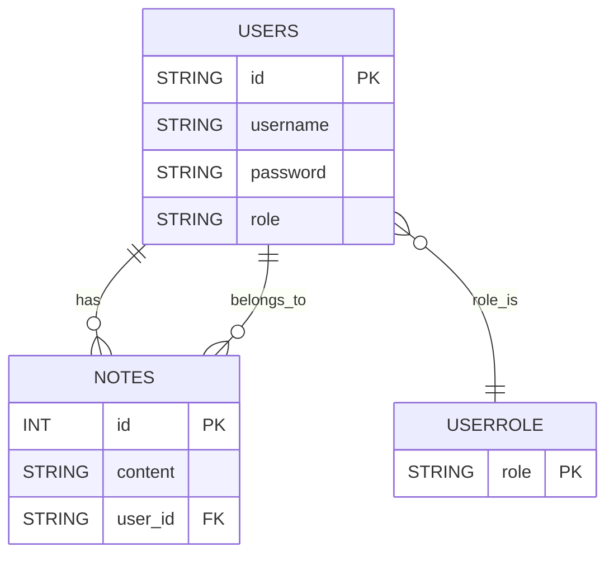

# SecureTimeNotes 📝⏱️

**SecureTimeNotes** é um aplicativo de anotações seguro, projetado para ajudar usuários a criar, editar e organizar suas notas de maneira prática e eficiente. Ele também oferece um cronômetro integrado e diversas funcionalidades úteis, como um calendário para compromissos, tudo com foco em segurança e facilidade de uso.

## Funcionalidades 🌟

- **Criação e Edição de Notas** 📝: Salve suas ideias, pensamentos e compromissos com facilidade.
- **Cronômetro** ⏱️: Um cronômetro simples para monitorar o tempo enquanto trabalha ou realiza outras atividades.
- **Calendário** 📅: Organize seus compromissos e eventos importantes diretamente no aplicativo.
- **Autenticação e Segurança** 🔐: Sistema de autenticação robusto com **Spring Security**, baseado em **JWT** (JSON Web Tokens) para garantir a segurança de dados do usuário.
- **Banco de Dados Temporário** 🗃️: Utilização do **H2 Database** para armazenamento temporário das notas e outros dados. O banco será eventualmente substituído por uma solução permanente.

## Tecnologias Utilizadas ⚙️

- **Backend**:
  - **Java Spring Boot** (JDK 17) ☕
  - **Spring Security** 🔒 para autenticação e controle de acesso
  - **JWT** (JSON Web Tokens) 💻 para segurança
  - **H2 Database** 🗃️ para armazenamento temporário

- **Frontend**: O frontend será desenvolvido posteriormente, com o objetivo de criar uma interface de usuário limpa e funcional.

## Instalação 🚀

### Pré-requisitos 🔧

Antes de começar, tenha o seguinte instalado:
- JDK 17 ou superior ☕
- Maven 📦
- IDE como **IntelliJ IDEA** ou **Eclipse** 💻 para desenvolvimento

### Passos ⬇️

1. Clone o repositório para sua máquina local:
   ```bash
   git clone https://github.com/andrefelipebarros/SecureTimeNotes.git
   ```

2. Navegue até o diretório do projeto:
   ```bash
   cd SecureTimeNotes
   ```

3. Compile o projeto:
   ```bash
   mvn clean install
   ```

4. Execute o servidor Spring Boot:
   ```bash
   mvn spring-boot:run
   ```

5. O backend estará rodando localmente na porta `8080` por padrão. 🌐 
(⚠OBS: Alterei no properties para porta 8081)

## Rotas e Endpoints 🚏

- **POST** `auth/login` 🔑: Realiza o login do usuário e retorna um token JWT.
- **POST** `auth/register` 🖊️: Registra um novo usuário.
- **GET** `user/notes` 📋: Retorna todas as notas do usuário autenticado.
- **POST** `user/notes` ✍️: Cria uma nova nota.
- **PUT** `user/notes/{id}` 🔄: Atualiza uma nota existente.
- **DELETE** `user/notes/{id}` 🗑️: Deleta uma nota.

Esses endpoints são protegidos por **Spring Security** 🔐 e requerem um token JWT válido para acessar.

## Diagramas 📊
Aqui está o **Diagrama de Classes**:

   ```mermaid
    classDiagram
        class User {
            +id : String
            +username : String
            +password : String
            +role : UserRole
            +notes : List~Note~
        }
    
        class Note {
            +id : Long
            +content : String
            +user : User
        }
    
        class UserRole {
            <<enum>>
            ADMIN
            USER
        }
    
        User "1" --> "*" Note : notes
        Note "*" --> "1" User : user
        User --> UserRole : role
   ```

Aqui está o diagrama do **SchemaDB** para ilustrar a estrutura do banco de dados:


## Contribuindo 🤝

1. Faça um fork deste repositório 🍴.
2. Crie uma branch com sua feature ou correção (`git checkout -b feature/nova-feature`).
3. Faça o commit das suas mudanças (`git commit -am 'Adicionar nova feature'`).
4. Envie a branch para o seu repositório remoto (`git push origin feature/nova-feature`).
5. Abra um Pull Request no repositório original.

## Licença 📜

Distribuído sob a licença MIT. Veja [LICENSE](LICENSE) para mais informações.

## Futuras Funcionalidades 🚧

- **Frontend** 🖥️: Desenvolvimento de uma interface de usuário intuitiva.
- **Suporte a múltiplos usuários** 👥: Expandir o sistema para permitir que várias pessoas acessem e compartilhem notas e compromissos.
- **Banco de Dados Permanente** 💾: Substituir o banco de dados H2 por uma solução de banco de dados mais robusta e escalável.

---

Para dúvidas ou sugestões, fique à vontade para abrir uma issue ou pull request. Esperamos que o **SecureTimeNotes** seja útil para o seu dia a dia! ✨
