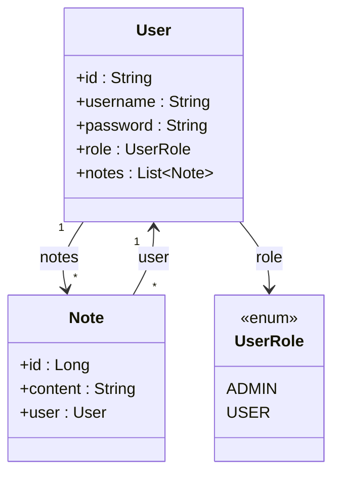
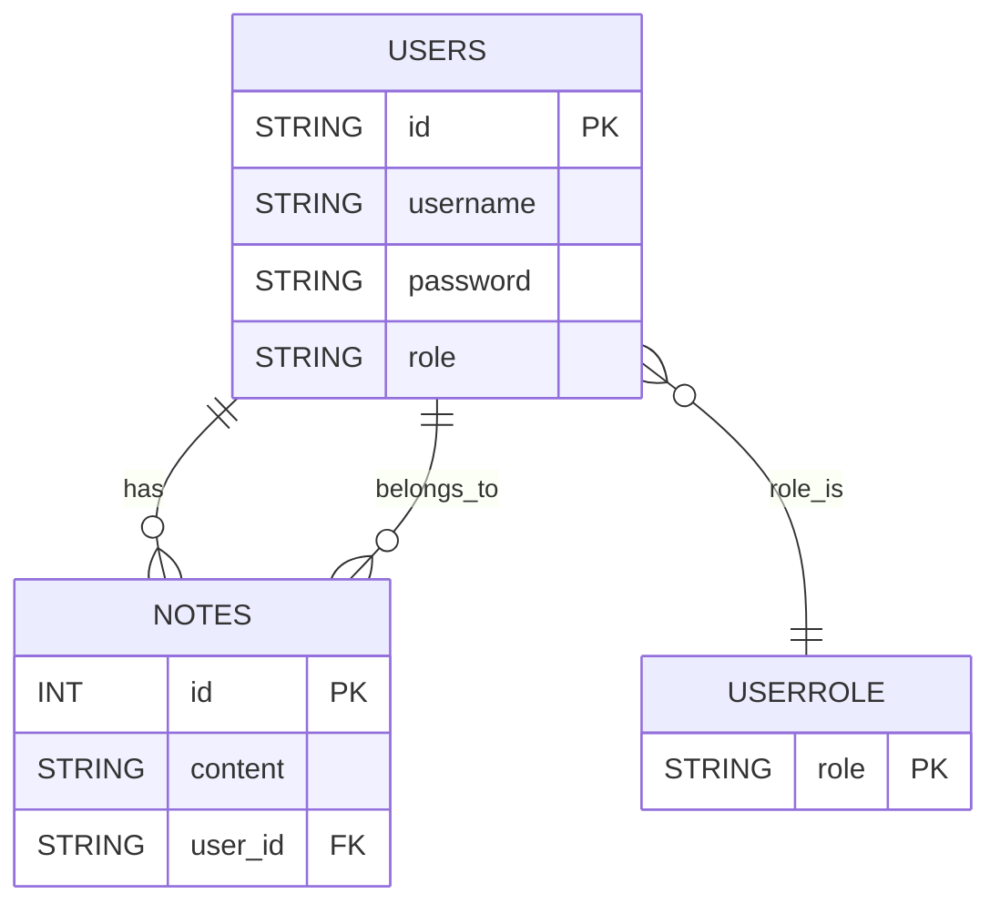

# SecureTimeNotes 📝⏱️

**SecureTimeNotes** é um aplicativo de anotações seguro, projetado para ajudar usuários a criar, editar e organizar suas notas de maneira prática e eficiente. Ele também oferece um cronômetro integrado e diversas funcionalidades úteis, como um calendário para compromissos — tudo com foco em segurança e facilidade de uso.

---

## 🔗 Documentação da API (Swagger)

Você pode visualizar e testar todos os endpoints diretamente pela interface Swagger:

👉 [Acesse o Swagger](https://securetimenotes.up.railway.app/swagger)

---

## 🌐 Acesse o Aplicativo

O frontend está disponível online:

👉 [Acesse o SecureTimeNotes](https://securetimenotes.netlify.app/)

---

## 📌 Funcionalidades

- **Criação e Edição de Notas**: Salve ideias, tarefas e compromissos com facilidade.
- **Cronômetro Integrado**: Monitore o tempo de forma prática.
- **Calendário**: Organize seus compromissos diretamente no app.
- **Autenticação Segura**: Com **Spring Security** e **JWT**.
- **Banco de Dados Temporário**: Utilização do **H2 Database** (em breve será substituído por uma solução permanente).

---

## ⚙️ Tecnologias Utilizadas

### Backend

- **Java 17** com **Spring Boot**
- **Spring Security** para autenticação e controle de acesso
- **JWT** (JSON Web Tokens)
- **H2 Database** para armazenamento temporário

### Frontend

- **Angular Standalone** (sem uso de `NgModules`)
- Aplicação leve, moderna e responsiva
- Integração com API segura usando tokens JWT
- Hospedado via **Netlify**: [securetimenotes.netlify.app](https://securetimenotes.netlify.app)

---

## 🚀 Instalação

### Pré-requisitos

- JDK 17 ou superior
- Maven
- IDE como IntelliJ IDEA ou Eclipse

### Passos para rodar localmente (Backend)

```bash
# Clone o repositório
git clone https://github.com/andrefelipebarros/SecureTimeNotes.git

# Acesse o diretório do projeto
cd SecureTimeNotes

# Compile o projeto
mvn clean install

# Execute o servidor
mvn spring-boot:run
```

> Por padrão, o backend roda na porta `8080`, mas foi configurado para `8081` no `application.properties`.

---

## 📬 Endpoints

Os principais endpoints disponíveis são:

| Método | Endpoint             | Descrição                       |
|--------|----------------------|---------------------------------|
| POST   | `/auth/login`        | Login do usuário (JWT)          |
| POST   | `/auth/register`     | Registro de novo usuário        |
| GET    | `/user/notes`        | Listar todas as notas           |
| POST   | `/user/notes`        | Criar uma nova nota             |
| PUT    | `/user/notes/{id}`   | Atualizar uma nota existente    |
| DELETE | `/user/notes/{id}`   | Deletar uma nota                |

> Todos os endpoints `/user/**` requerem autenticação via JWT 🔐

---

## 📊 Diagramas

### Diagrama de Classes



### Diagrama do Schema (Banco de Dados)



---

## 🤝 Contribuindo

1. Faça um fork do repositório
2. Crie uma branch: `git checkout -b feature/minha-feature`
3. Commit suas mudanças: `git commit -m 'Minha contribuição'`
4. Push para o repositório: `git push origin feature/minha-feature`
5. Crie um Pull Request

---

## 📜 Licença

Este projeto está licenciado sob a Licença MIT. Consulte o arquivo [LICENSE](LICENSE) para mais informações.

---

## 🔮 Futuras Funcionalidades

- **Mais funcionalidades no frontend**
- **Compartilhamento de notas entre usuários**
- **Substituição do banco de dados H2 por uma solução permanente (PostgreSQL, por exemplo)**

---

Em caso de dúvidas ou sugestões, abra uma issue ou envie um pull request.

Agradecemos por usar o **SecureTimeNotes**! ✨
